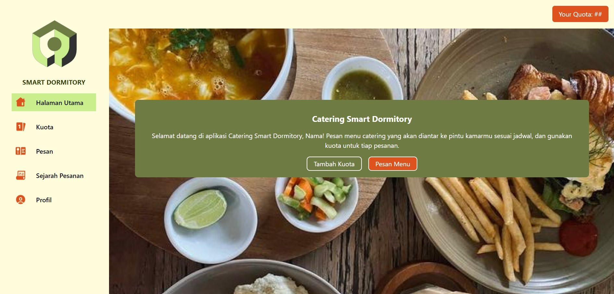
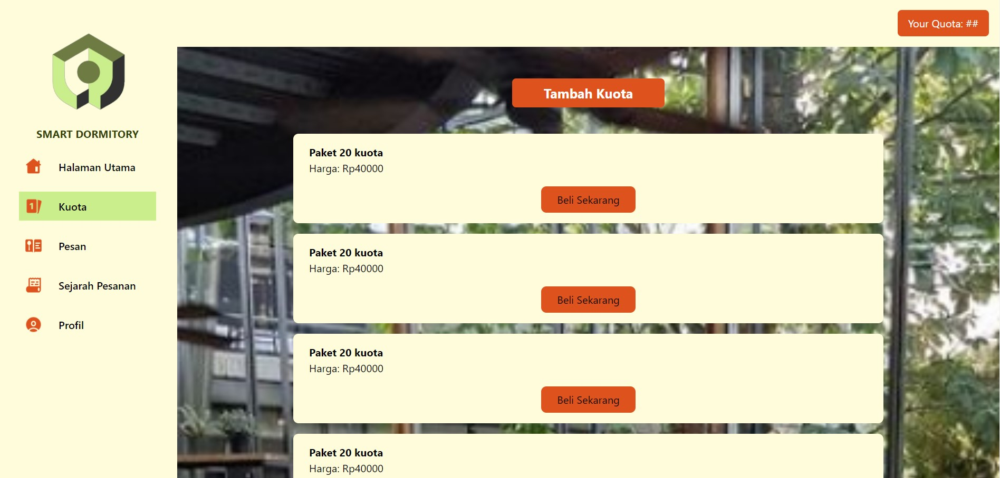
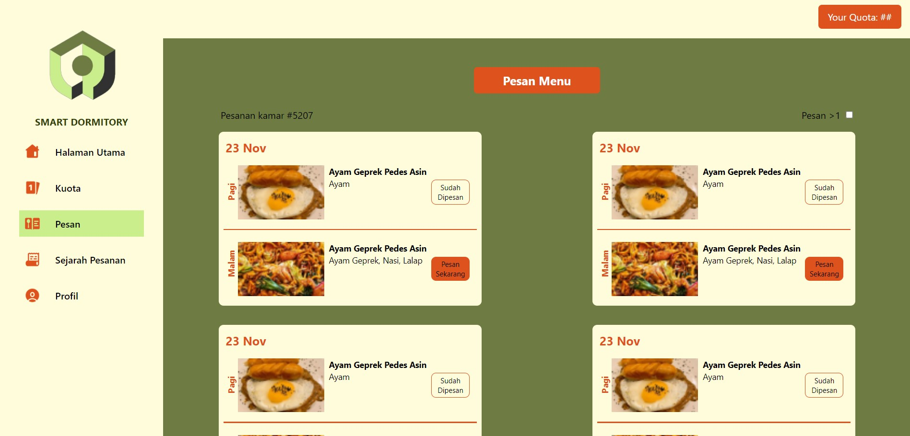
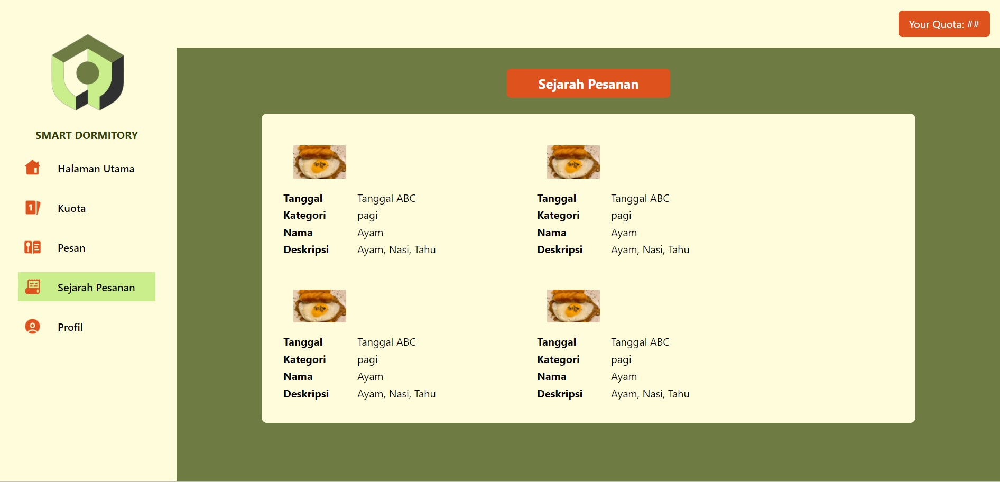
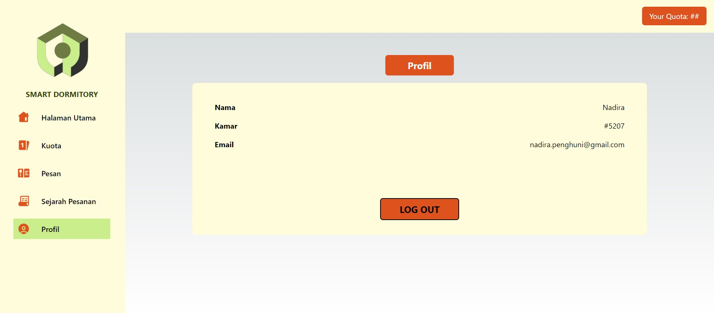

<h1 align="center">SMART DORMITORY</h1>

## About Smart Dormitory

<div style="text-align: justify">
Smart Dormitory merupakan sebuah sistem layanan yang dibuat dengan tujuan untuk memudahkan proses pengelolaan dan administrasi asrama. Layanan yang disediakan oleh asrama adalah pengelolaan penerimaan penghuni baru, pengelolaan kontrak dan keuangan, serta pengelolaan layanan tambahan asrama. Layanan ini dimulai dari penerimaan penghuni baru melalui promosi yang dilakukan oleh pihak pemasaran Dormitory. Calon penghuni kemudian melewati proses aplikasi, seleksi dan onboarding. Setelah melalui proses penerimaan, calon penghuni melakukan penandatanganan kontrak sewa dan pembayaran uang deposit. Calon penghuni kemudian resmi menjadi penghuni, dan akan mendapatkan berbagai layanan Dormitory hingga mereka menyelesaikan masa sewa mereka.
</div>

## Anggota Kelompok 10

| NIM      | Nama                       |
| -------- | -------------------------- |
| 18221059 | Nadira Rahmananda Arifandi |
| 18221063 | Timothy Subekti            |
| 18221081 | Nadine Aliya Putri         |
| 18221093 | Carissa Zahrani Putri      |
| 18221147 | Benyamin Jodi Sitinjak     |

## Implementasi Prototype Smart Dormitory

<div style="text-align: justify">
Prototype yang dikembangkan pada Smart Dormitory berfokus pada proses bisnis pengelolaan layanan tambahan, yaitu pada pengelolaan sistem catering yang ditawarkan oleh pihak asrama dalam bentuk sebuah website. Dengan menggunakan website Smart Dormitory, penghuni asrama dapat melakukan pemesanan paket catering yang diinginkan, memilih menu catering, serta melakukan proses pembayaran.
</div>

## Implementasi Method Back-End
Berikut adalah fungsionalitas yang terdapat pada back-end dan method untuk melakukannya  
**1. Melihat Paket :** GET/package  
**2. Membeli Paket/Menambah Kuota :** PATCH/user/quota/:id  
**3. Melakukan Pembayaran :** POST/payment  
**4. Membuat Menu :** POST/menu  
**5. Melihat Menu :** GET/menu  
**6. Melakukan Pemesanan :** POST/order  
**7. Menerima Data Pemesanan :** GET/order


## Cara Menjalankan Prototype Smart Dormitory
<div style="text-align: justify">

**Cara Menjalankan Prototype dari IDE**  
Pertama, download project github ini pada local machine untuk mencobanya  
Clone git dengan code berikut

```bash
  git clone https://github.com/nadiraaraa/LSTI.git
```

Jika sudah, tujukan terminal ke directory project
```bash
  cd Path/to/smart-dormitory
```

Untuk menjalankan web secara local, ketik code berikut
```bash
  npm i
```
Lanjutkan dengan code berikut
```bash
  npm run dev
```  

**Cara Menjalankan Prototype dari Link Website**  
Klik link berikut untuk menuju website  
```bash
  https://smart-dormitory-lsti-k10.vercel.app/
```  
</div>


## Fungsionalitas yang Terdapat Pada Prototype 
<div style="text-align: justify">

Berikut adalah Fungsionalitas dan tampilan pada website  
**1. Penghuni akan dibawa ke tampilan utama dashboard sebelum melakukan pemesanan kuota katering dan menu**  
  
  
**2. Penghuni dapat memilih kuota makan yang akan dibeli**  
  

**3. Setelah membeli kuota, penghuni dapat memilih menu yang akan dikirim pada tanggal sesuai pilihannya**  
  
  
**4. Penghuni dapat melihat riwayat pemesanan menu**    
  

**5. Penghuni dapat mengelola akun website layanan cateringnya**  
  
</div>
